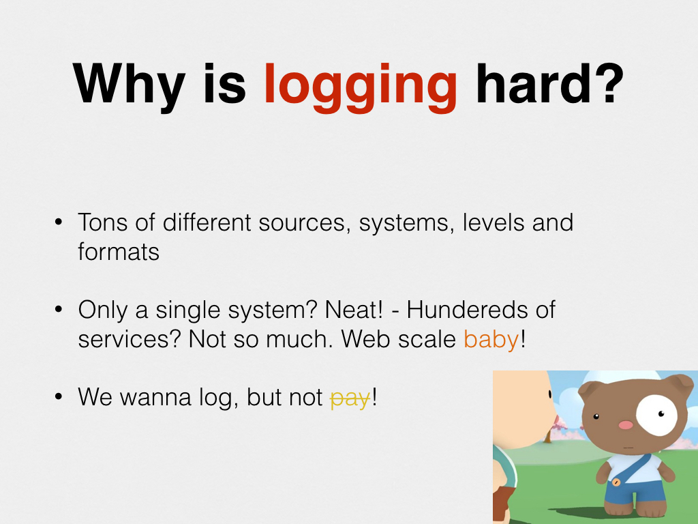
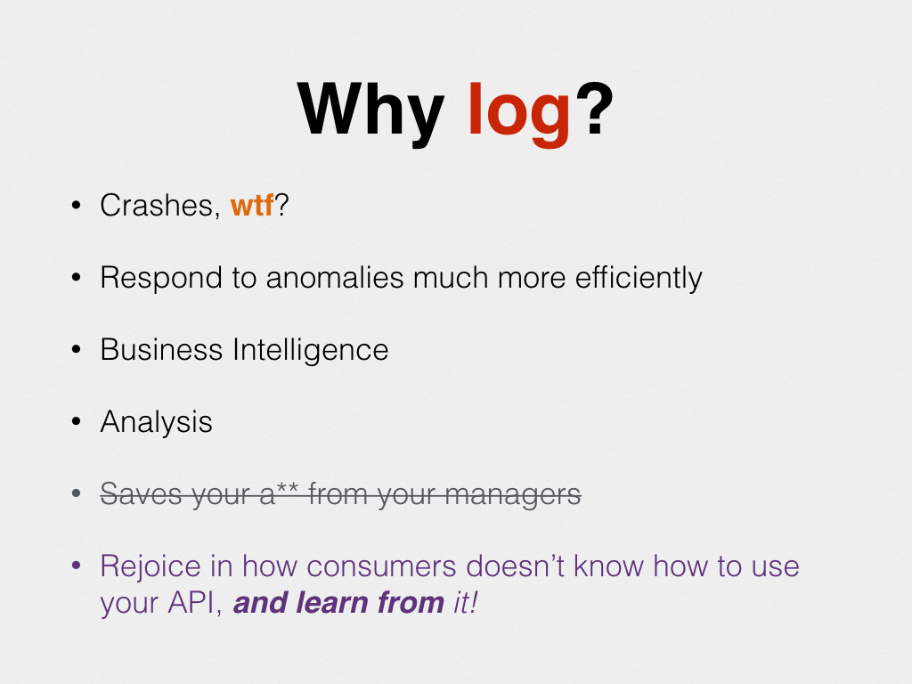
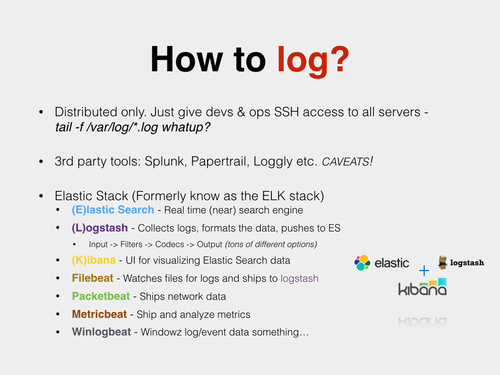
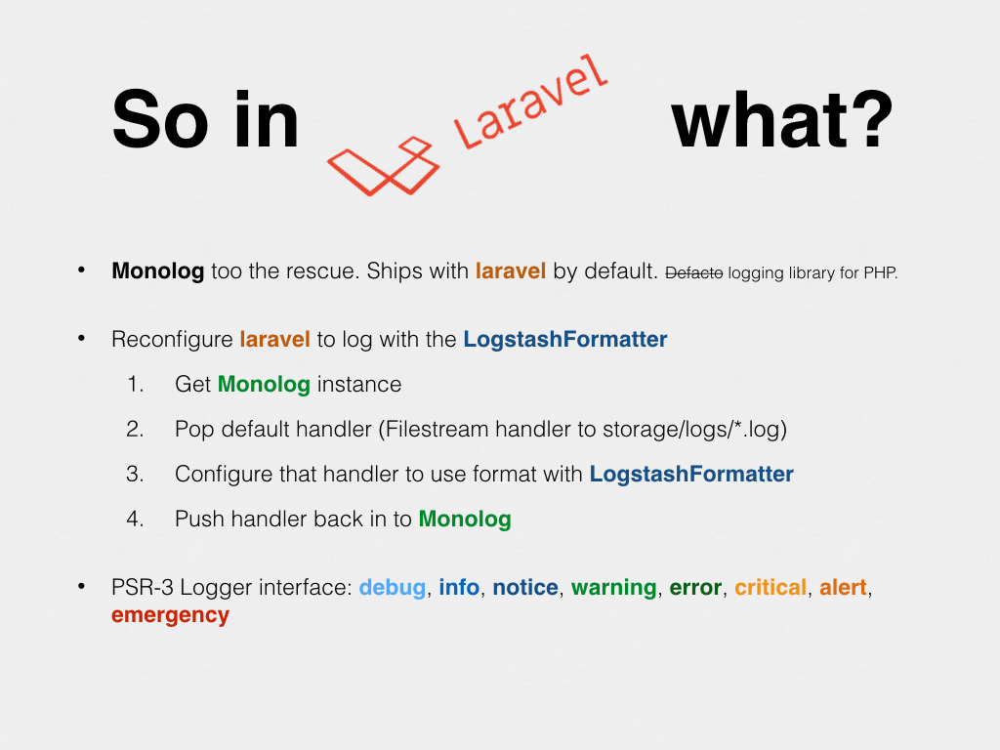
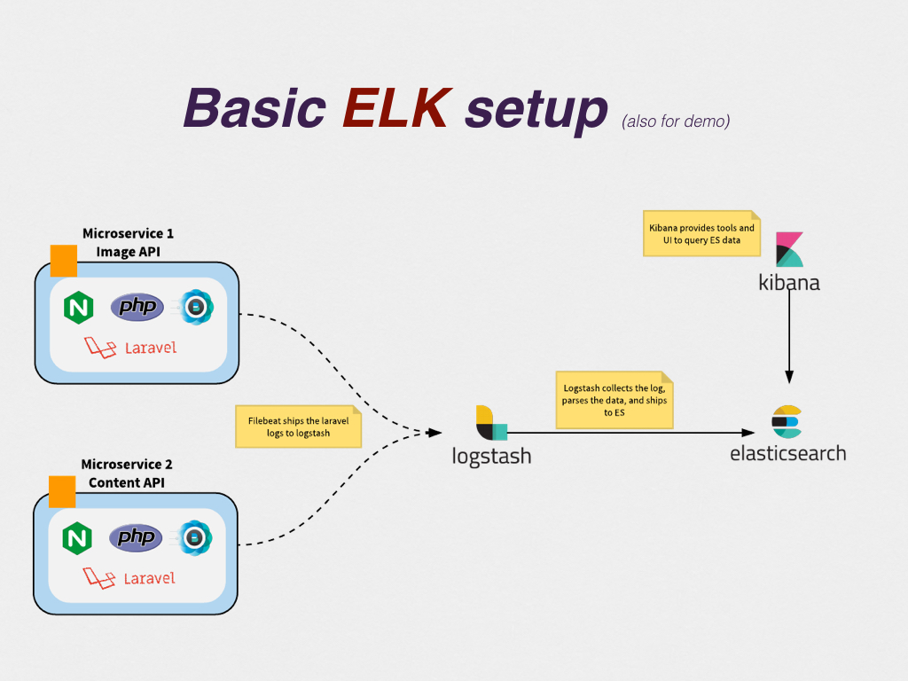
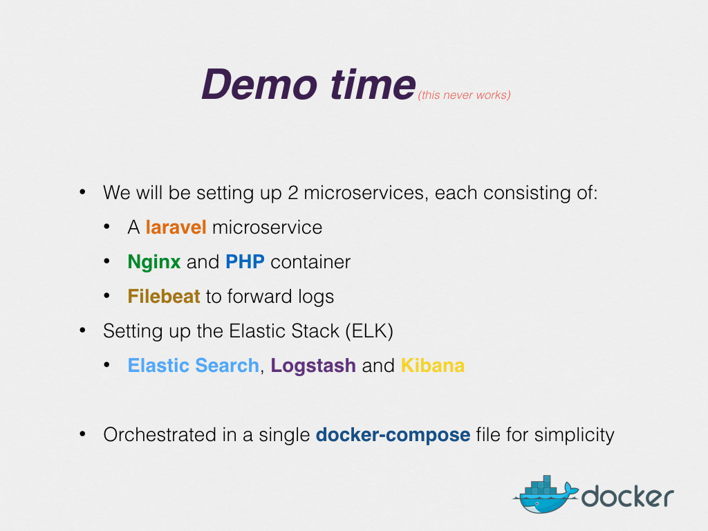

# Centralised Logging System for any application in an ElasticStack. Wired up with docker-compose

Contains a docker-compose declaration that boots up both laravel/lumen services and the Elastic Stack (5).

The Laravel services is pretty much bare bone out of the box. Only configuration done was changing the logging format in Monolog to logstash. That happens in `app/Providers/AppServiceProvider.php`

Setup laravel/lumen basic steps along with composer install

After `docker-compose up`:

* Content API(Laravel): http://localhost:8080
* Image API(Laravel): http://localhost:8081
* Blog API(Lumen): http://localhost:8082
* Kibana: http://localhost:5601

# Elastic is configured with basic auth
- User:elastic
- Password:changeme

# Configure Log indices
- Add `logstash*` in log indices list
- Go to Logs section to stream realtime logs

# Slides

# laravel-lumen-elk-docker
